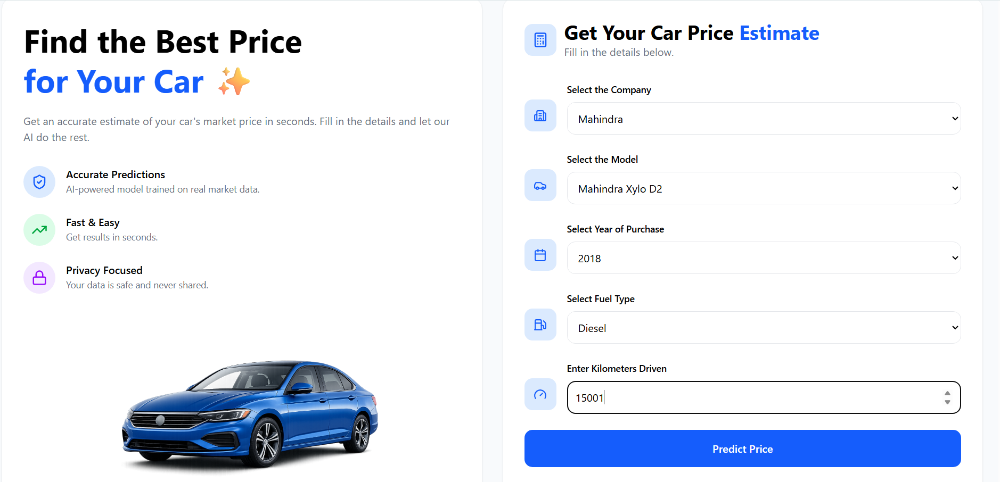

# 🚗 CarPrice AI — Used Car Price Estimator

> An AI-powered web application that predicts the resale value of used cars in seconds using a trained machine learning model.


---

## 📸 Screenshots

### Home Page — Price Estimation Form
Fill in the car details and hit **Predict Price** to get an instant estimate.



### Output Page — Prediction Results
View the estimated selling price along with a detailed vehicle analysis breakdown.


---

## ✨ Features

- **AI-Powered Predictions** — Machine learning model trained on real Indian used car market data
- **Detailed Vehicle Analysis** — Get insights on vehicle age, mileage category, condition, and depreciation
- **Fast & Easy** — Fill in a few details and get results in seconds
- **Privacy Focused** — Your data is never stored or shared
- **Clean, Responsive UI** — Built with React for a smooth user experience

---

## 🛠️ Tech Stack

| Layer | Technology |
|---|---|
| Frontend | React.js + Vite |
| Backend / API | Flask (Python) |
| ML Model | Linear Regression (Scikit-learn) |
| Styling | CSS |
| Data | Cleaned Indian Used Car Dataset (CSV) |

---

## 📁 Project Structure

```
carprice-ai/
├── backend/
│   ├── venv/                    # Python virtual environment
│   ├── app.py                   # Flask API entry point
│   ├── Cleaned Car.csv          # Cleaned dataset used for training
│   ├── LinearRegression...      # Trained Linear Regression model (pickle)
│   └── .gitignore
│
├── frontend/
│   ├── node_modules/
│   ├── public/
│   ├── src/
│   │   ├── assets/              # Static assets
│   │   ├── images/              # Car images used in UI
│   │   ├── pages/
│   │   │   ├── HomePage.jsx     # Input form — car details & predict button
│   │   │   └── OutputPage.jsx   # Results — estimated price & vehicle analysis
│   │   ├── App.css
│   │   ├── App.jsx              # Root component & routing
│   │   ├── index.css
│   │   └── main.jsx             # React entry point (Vite)
│   ├── .gitignore
│   ├── eslint.config.js
│   ├── index.html
│   ├── package.json
│   ├── package-lock.json
│   └── vite.config.js
│
└── README.md
```

---

## 🚀 Getting Started

### Prerequisites

- Python 3.9+
- Node.js 18+
- npm or yarn

---

### 1. Clone the Repository

```bash
git clone https://github.com/your-username/carprice-ai.git
cd carprice-ai
```

---

### 2. Backend Setup (Flask API)

```bash
cd backend
python -m venv venv
source venv/bin/activate        # On Windows: venv\Scripts\activate
pip install -r requirements.txt
python app.py
```

The Flask API will start at **http://localhost:5000**

---

### 3. Frontend Setup (React)

```bash
cd frontend
npm install
npm run dev
```

The React app will start at **http://localhost:5173** (Vite default)

---

## 🔌 API Reference

### `POST /predict`

Predicts the resale price of a used car.

**Request Body:**

```json
{
  "company": "Mahindra",
  "model": "Mahindra Xylo D2",
  "year": 2018,
  "fuel_type": "Diesel",
  "kms_driven": 15000
}
```

**Response:**

```json
{
  "estimated_price": 673521.59,
  "vehicle_age": 8,
  "mileage_category": "Low Mileage",
  "condition": "Good",
  "depreciation": "Medium"
}
```

---

## 🧠 How the Model Works

1. **Data Collection** — Trained on a real-world Indian used car dataset with features like brand, model, year, fuel type, and kilometers driven.
2. **Preprocessing** — Categorical encoding, feature scaling, and outlier removal.
3. **Model Training** — A **Linear Regression** model is trained on the cleaned dataset and serialized as a pickle file.
4. **Prediction** — The Flask API loads the model and returns a price estimate along with derived vehicle analysis (age, mileage bucket, depreciation level).

---

## 📊 Input Fields

| Field | Type | Example |
|---|---|---|
| Company | Dropdown | Mahindra |
| Model | Dropdown | Mahindra Xylo D2 |
| Year of Purchase | Dropdown | 2018 |
| Fuel Type | Dropdown | Diesel |
| Kilometers Driven | Number | 15,000 |

---

## 📈 Output Explained

| Field | Description |
|---|---|
| Estimated Selling Price | Predicted resale value in INR (₹) |
| Vehicle Age | Age of car in years as of current year |
| Mileage Category | Low / Medium / High based on km driven |
| Condition | Good / Fair / Poor based on age & mileage |
| Depreciation | Low / Medium / High — value reduction over time |

---

## 🤝 Contributing

Contributions are welcome! Please follow these steps:

1. Fork the repository
2. Create a new branch: `git checkout -b feature/your-feature-name`
3. Commit your changes: `git commit -m 'Add some feature'`
4. Push to the branch: `git push origin feature/your-feature-name`
5. Open a Pull Request

---

## 📄 License

This project is licensed under the [MIT License](LICENSE).

---

## 👨‍💻 Author

Made with ❤️ by **[Your Name](https://github.com/your-username)**

---

> ⭐ If you found this project helpful, give it a star on GitHub!
